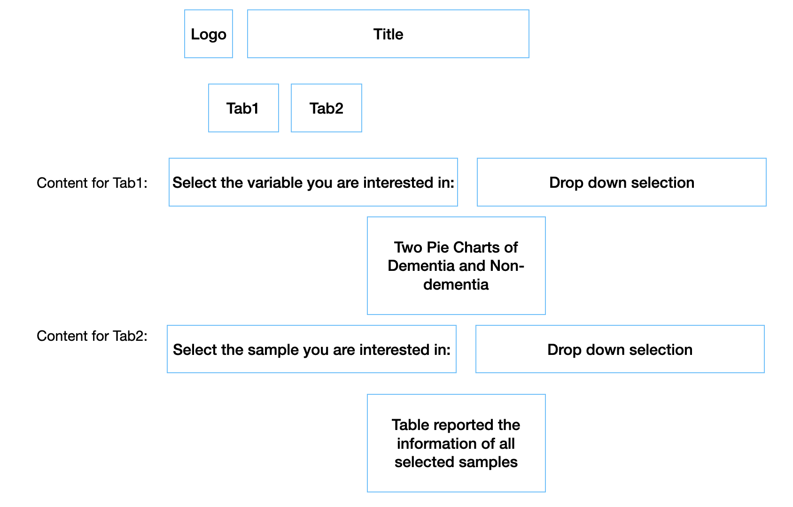

# BMI 709 - Student Project

In this individual project students will design and implement their 
own biomedical informatics Shiny dashboard based on what they learned in class.

## Student Info

- First (preferred) name: Yuchen
- Last name: Cheng
- Program / Year: MBI Y2

## Title: Meta Data Explorer for snRNA-seq data from SEA-AD
This Shiny App aims at displaying metadata summary for the snRNA-seq data from SEA-AD database on AD and control samples.

## Motivation & Background

<!--write a paragraph or two about your motivation for creating this dashboard 
and provide some background information on the dashboard content if needed-->
SEA-AD consortium published a publicly available snRNA-seq dataset on 31 AD and 31 control samples, which could be used for various studies, such as somatic variant detection on single-cell level. Since somatic mutation burden is highly relevant to many demographic variables, such as age, sex and sequencing coverage. I plan to established a dashboard where users can visualize the meta information of each individual as well as the summary statistics.

## Dashboard Description & Usage

<!-- 
In the first phase, list all the inputs / outputs that will be available in your
dashboard. Your app must have multiple tabs, so make sure to list them accordingly

example:

- <input/output seen at all times>
- Tab 1
  - <input / output of tab 1>
  - <input / output of tab 1>
- Tab 2
  - <input / output of tab 2>
  - <input / output of tab 2>
...

We encourage you to make a sketch of your overall app layout (and for each of 
the tabs), which you are welcome to insert here as images or add to the pull
request so we can get a better idea of what you have in mind.
-->
Contents:  
- Input seen at all time: 
  - logo of the database
  - Title of the project
  
-Tab 1 (visualize the composition of meta variables)
  - Input: Variable type (age/sex/pathological features)
  - Output: Interactive bar chart visualizing the variable composition in AD vs control group
  - Output: list of categories including in the plot

-Tab 2 (select the metadata based on donor id for the samples users want to conduct analysis on (e.g. get matched metadata with selected transcriptome data) with the download option)
  - Input: select individual
  - Output: a extendable table that could display the metadata for every selected individual
  - Download: the table could be downloaded

-Tab 3 (filter out samples that match with specific AD pathologies with the download option)
  - Inputs (3): select based on different features (dementia/non-dementa, samples of certain ADNC score/Braak State)
  - Output: A curated dataset based on the three filters
  - Download: the dataset could be downloaded

<!---->

<!-- In the later phase replace this section with practical info or a tutorial 
on how to navigate the dashboard and interact with it You can create additional
markdown files and reference them here if needed-->

## References

<!--list any relevant references like data sources used or other work that 
served as an inspiration for this dashboard-->
Introduction to the dataset: https://registry.opendata.aws/allen-sea-ad-atlas/  
The data can be downloaded from: https://www.synapse.org/#!Synapse:syn26223298

***
*This project is part of the BMI 709 course offered by the Master
of Biomedical Informatics at Harvard Medical School.*
